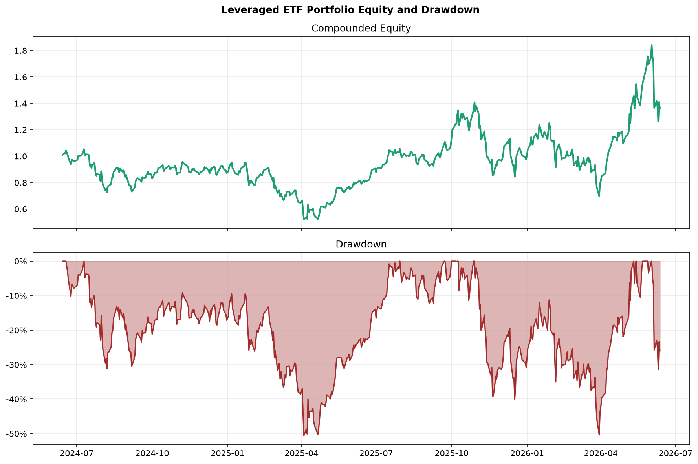
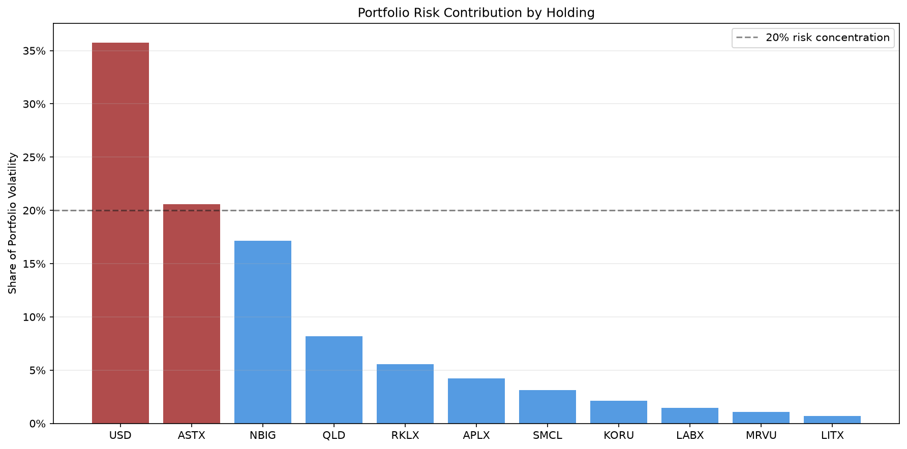
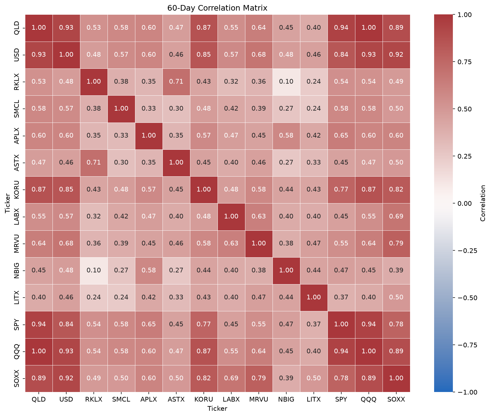
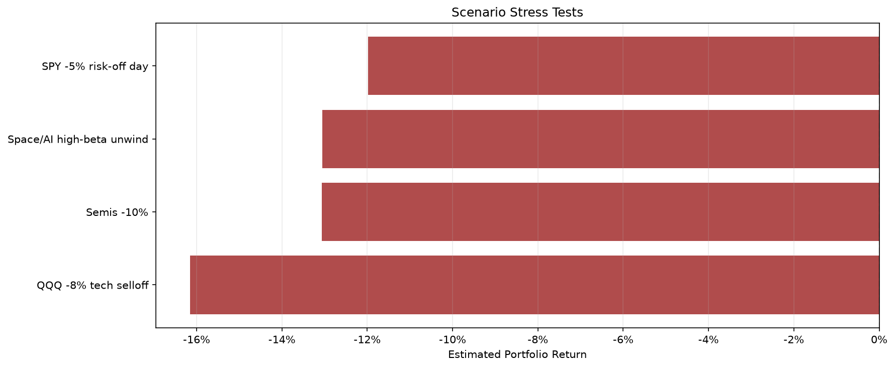

# Leveraged ETF Risk Lab

A quantitative risk dashboard for a concentrated portfolio of leveraged ETFs and high-volatility thematic exposure.

## Research Question

Am I being paid for taking aggressive leveraged ETF risk, or am I accidentally stacking the same trade across semiconductors, AI, space, biotech, and high-beta growth?

This project was built from a real investing problem: managing a portfolio tilted toward leveraged ETFs and volatile themes. The goal is not to make the portfolio look safer than it is. The goal is to measure risk clearly enough to make better decisions.

## What This Does

- Measures portfolio beta vs SPY, QQQ, and SOXX
- Estimates annualized return, volatility, Sharpe ratio, and max drawdown
- Identifies which holdings contribute the most risk
- Detects crowded/correlated exposure
- Runs scenario stress tests
- Generates rule-based rebalance recommendations
- Tracks weekly observations in a decision journal

## Why Leveraged ETFs Need Risk Monitoring

Leveraged ETFs can be useful tactical instruments, but they are path-dependent. A 2x or 3x ETF does not simply deliver two or three times the long-term return of the underlying index. Daily reset, volatility decay, drawdowns, and correlated exposure can dominate the result.

This project treats leveraged ETFs as a portfolio risk problem, not just a return opportunity.

## Example Universe

| Ticker | Theme |
|---|---|
| QLD | 2x Nasdaq-100 |
| USD | 2x Semiconductors |
| RKLX | 2x Rocket Lab exposure |
| SMCL | 2x Super Micro exposure |
| APLX | 2x Apple exposure |
| ASTX | 2x AST SpaceMobile exposure |
| KORU | 3x South Korea equities |
| LABX | 2x biotech exposure |
| MRVU | 2x Magnificent 7 exposure |
| NBIG | 2x Nebius exposure |
| LITX | 2x lithium exposure |

Tickers can be edited in `src/config.py`.

For real portfolio weights, copy `portfolio_values.example.csv` to `portfolio_values.csv` and update the market values. The live `portfolio_values.csv` file is gitignored.

## Methodology

The dashboard uses daily adjusted close data from Yahoo Finance.

Core metrics:

- Log returns
- Annualized return
- Annualized volatility
- Sharpe ratio
- Max drawdown
- Beta vs SPY, QQQ, and SOXX
- Correlation matrix
- Risk contribution by holding
- Scenario stress tests

## Rebalance Decision Engine

`src/rebalance.py` generates simple risk-based recommendations:

| Action | Meaning |
|---|---|
| HOLD | Risk is currently within limits |
| TRIM | One position contributes too much portfolio risk |
| DELEVERAGE | Portfolio beta or volatility is too high |
| RISK_OFF | Drawdown has crossed the risk limit |

The rules are intentionally simple and transparent. They are not trading signals. They are guardrails for risk management.

## Example Outputs

### Portfolio Equity and Drawdown



### Risk Contribution



### Correlation Heatmap



### Stress Tests



## Quickstart

```bash
git clone https://github.com/asoracca/leveraged-etf-risk-lab.git
cd leveraged-etf-risk-lab
pip install -r requirements.txt
python main.py
